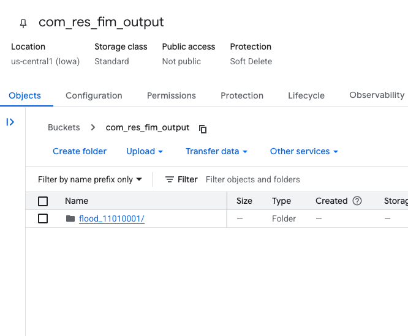

# FIM Generation

This directory contains the code to generate the FIM layers
that are displayed in the web application. This is made possible
by combining two existing community efforts into a containerized
workflow. These community efforts are:

- `https://github.com/NOAA-OWP/inundation-mapping`
- `https://github.com/sdmlua/FIMserv`

### Description of Files

- **Dockerfile**: This file contains the instructions to build the Docker image. This includes installing the necessary dependencies and copying the code into the image from the NOAA OWP flood inundation mapping and CIROH FIMserv repositories.

- **generate_fim.py**: This is the main script that runs the FIM generation process. It takes in a HUC-8 code, a list of gages, and a list of gage heights to generate the FIM layers.

- **compute_rating_increments.py**: This script computes the rating increments for the FIM generation process. It is used by the `generate_fim.py` script to determine the necessary increments based on the gage heights provided.

- **run.sh**: This script is used to run the Docker container with the necessary arguments. It mounts the data and output directories to the container and runs the `generate_fim.py` script.

- **run-debug-mode.sh**: This script is used to run the Docker container in interactive mode for debugging purposes. It allows you to run the container with a shell prompt to inspect the environment and run commands manually.

### Workflow Overview

To run this workflow you'll need to perform the following steps:

1. Build the Docker image

  `docker build -t cuahsi/fimserv:latest .`

2. Make directories to mount data in and out of the container

  `mkdir data`

  `mkdir output`

3. Run the image

  `run.sh <args>`

  A complete example is:

  `run.sh reachfim 03020202 11237685,11238339,11237771 400,300,300`

  alternatively, you can run the image with the following command to run in debug mode:

  `run-interactive.sh`

  This will first download the necessary data from AWS, then perform the FIM computations, and finally save the output to the `output` directory.

To generate FIM for range of scenarios, you can use the `reachfim_interval` command.

`run.sh reachfim_interval 03020202 11237685 5 2`

where `5` is the stage interval to generate FIMS for and `2` is the number of threads to use for processing.

### Running in the cloud

Retag the image and push it to Artifact Registry:
`docker tag cuahsi/fimserv:0.2 us-central1-docker.pkg.dev/com-res/cuahsi/fimserv:0.2`

Or build it fresh:
`docker build -t us-central1-docker.pkg.dev/com-res/cuahsi/fimserv:latest .`

Push the image:
`docker push us-central1-docker.pkg.dev/com-res/cuahsi/fimserv:latest`

You can see the image in the repository here:
[Artifact Registry](https://console.cloud.google.com/artifacts/docker/com-res/us-central1/cuahsi/fimserv?inv=1&invt=Ab1J9A&project=com-res)

The cloud run job can be found here:
[fimserv cloud run job](https://console.cloud.google.com/run/jobs/details/us-central1/fimserv/executions?inv=1&invt=Ab1KKQ&project=com-res)

It is also defined in YAML here:
[cloudrun.yaml](./cloud/cloudrun.yaml)

You can edit the yaml in the cloud console UI here:
[console yaml edit](https://console.cloud.google.com/run/jobs/details/us-central1/fimserv/yaml/edit?inv=1&invt=Ab1KKQ&project=com-res)

The job can be run with the following command (obviously you can alter the args):
`gcloud run jobs execute fimserv --region=us-central1 --project=com-res --args=reachfim_interval,11010001,8585030,10,1`

The output goes into a bucket:
[com_res_fim_output](https://console.cloud.google.com/storage/browser/com_res_fim_output)

WIP:
1. I created a bucket [inundation-mapping-and-fimserv](https://console.cloud.google.com/storage/browser/inundation-mapping-and-fimserv). The goal would be to upload the necessary software to this bucket so that it doesn't have to be downloaded every time the job is run!